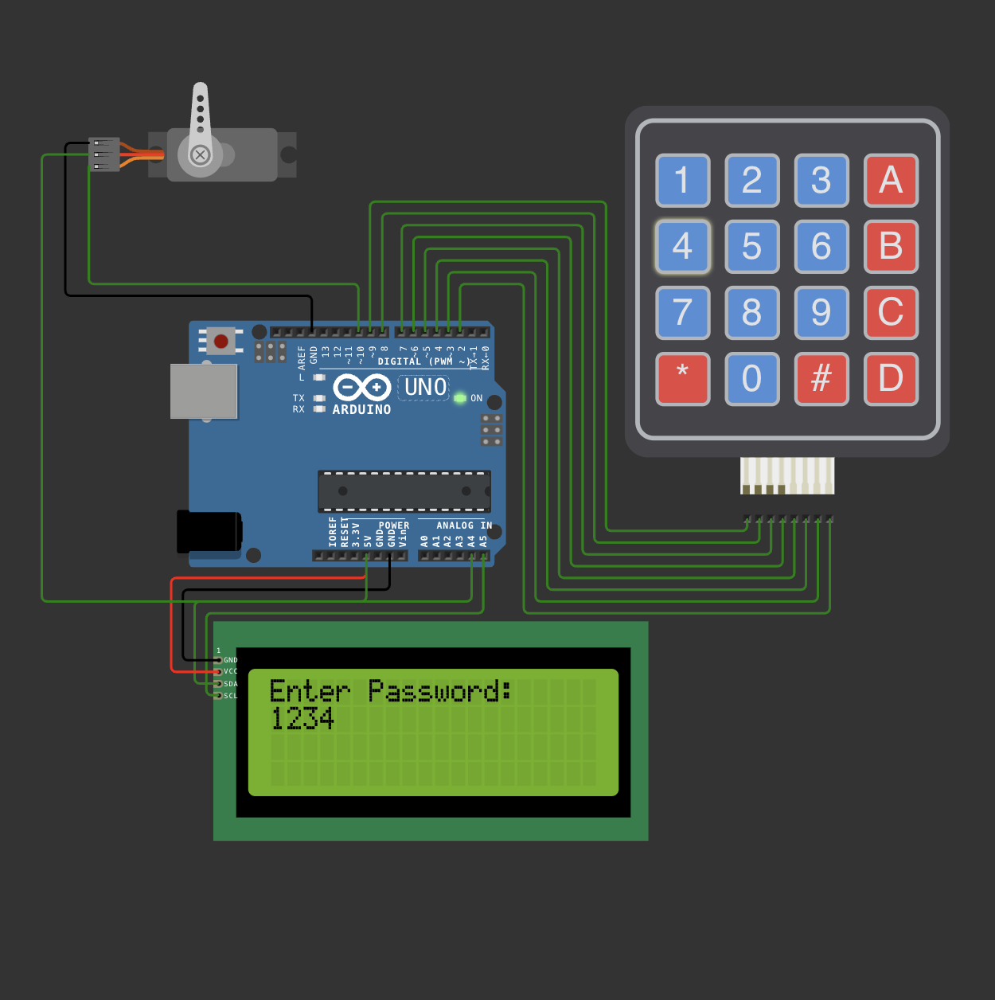

# PASS-Protected Door Lock System

An Arduino-based electronic door lock secured by a numeric password (PIN). The system accepts input from a 4x4 (or 3x4) matrix keypad, checks the entered PIN against a stored password, and actuates a lock (servo motor or electronic strike) when the PIN is correct. A 16×2 LCD (or OLED) provides user feedback, and optional buzzer/LEDs indicate success/failure.

---

## 🔐 Project Overview

This project demonstrates a simple, low-cost pass-protected door lock suitable for learning embedded systems, microcontroller I/O, and basic security logic.

Key behaviors:

* Accepts numeric PIN via keypad.
* Compares entered PIN to stored PIN in memory (optionally saved to EEPROM).
* Unlocks door (servo or relay) for a configurable time on correct PIN.
* Shows messages on LCD and provides audible/visual feedback for wrong PIN.
* Includes lockout after configurable number of wrong attempts (optional).

---

## 🚀 Features

* PIN entry with backspace and clear
* Configurable PIN length and timeout
* Visual feedback on a 16×2 LCD or serial monitor
* Audible beep for keypress, success, and failure (optional)
* Option to change PIN (with current PIN confirmation)
* Lockout mode after N failed attempts (optional)

---
 ## Circuit Diagram

✅ You can also view the full simulation using the Wokwi project link below.

🔗 Wokwi Simulation
https://wokwi.com/projects/431491247864819713
---

## 🔧 Components

* Arduino Uno (or any compatible board)
* 4x4 (or 3x4) Matrix Keypad
* Servo motor (e.g., SG90) **or** electromagnetic lock + relay/driver
* 16×2 LCD (with or without I2C backpack) or small OLED
* Buzzer (active or passive) — optional
* LEDs (Green for unlocked, Red for locked/failed) — optional
* 10k potentiometer (for LCD contrast) — if using parallel LCD
* Jumper wires and breadboard
* Power supply suitable for servo/lock (do *not* power locks from Arduino 5V directly if they draw large current)

---

## 🧭 Circuit / Wiring (example)

**Keypad**

* Row pins -> Arduino digital pins (e.g., 9, 8, 7, 6)
* Column pins -> Arduino digital pins (e.g., 5, 4, 3, 2)

**LCD (I2C)**

* SDA -> A4 (Uno)
* SCL -> A5 (Uno)
* VCC -> 5V
* GND -> GND

**Servo (lock actuator)**

* Signal -> D10 (example)
* VCC -> 5V external (if needed)
* GND -> Common ground with Arduino

**Buzzer / LEDs**

* Buzzer -> Digital pin via resistor/transistor if needed
* LEDs -> Digital pins (with 220Ω resistors)

> ⚠️ Safety note: If using a high-current electromagnetic lock or a solenoid, use an external power source and an appropriate driver/relay/transistor and flyback diode. Never drive high-current loads directly from the Arduino 5V pin.

---

## 📁 Files in this Repo

| File               | Description                                                       |
| ------------------ | ----------------------------------------------------------------- |
| `DoorLock.ino`     | Main Arduino sketch (handles keypad, PIN logic, actuator control) |
| `README.md`        | This document                                                     |
| `diagram.png`      | Circuit diagram (breadboard / wiring)                             |
| `libraries.txt`    | List of required Arduino libraries                                |
| `circuit-diagram/` | Folder containing images of wiring and PCB mockups                |

---

## 🧾 Required Libraries

* `Keypad` — for matrix keypad scanning
* `Servo` — if using a servo actuator
* `LiquidCrystal` or `LiquidCrystal_I2C` — for 16×2 LCD (I2C recommended)
* `EEPROM` — (optional) to store PIN persistently

Most of these can be installed through the Arduino Library Manager.

---

## 🧩 Example Behavior & Settings (defaults)

* Default PIN: `1234`
* Unlock duration: `5` seconds
* Max wrong attempts before lockout: `3` (lockout timeout 30 seconds)

You can change these values at the top of the sketch.

---

## ▶️ How to Run

1. Install required libraries via Arduino IDE (`Sketch` → `Include Library` → `Manage Libraries`).
2. Open `DoorLock.ino` in Arduino IDE.
3. Connect hardware following the wiring section (or load the provided simulation if included).
4. Upload sketch to Arduino.
5. Use the keypad to enter PIN. LCD will show prompts like `ENTER PIN:` and `ACCESS GRANTED` / `ACCESS DENIED`.

---

## 🧪 Troubleshooting

* **Keypad presses not detected**: Check wiring and match the row/column pins defined in the sketch.
* **LCD shows garbled text**: Adjust contrast potentiometer or verify correct I2C address (use I2C scanner sketch to find address).
* **Servo doesn’t move**: Ensure separate power if servo draws significant current; confirm ground common with Arduino.
* **False triggers / noisy sensor inputs**: Debounce keypad or add small delays when reading keys.

---

## 🔐 Security Considerations

* Do not treat this as a production-ready security product — it's for educational use only.
* PINs stored in EEPROM can be read/unlocked by anyone with physical access to the microcontroller. Consider secure hardware for serious applications.
* Consider adding tamper detection, encrypted storage, or multi-factor authentication for higher security.

---

## ✅ Possible Improvements

* Replace Arduino with a microcontroller that supports cryptographic storage.
* Add RFID/NFC badge authentication as an alternative or second factor.
* Use RTC to timestamp access events and store logs on SD card.
* Add web/mobile app integration (e.g., via ESP32/ESP8266) for remote PIN changes and audit logs.

---

## ✍️ Author

Created by Shogun — adapt and improve for learning and safe experimentation.

---

## 📜 License

This project is open-source under the **MIT License**. Feel free to use, modify and redistribute with attribution.

---
